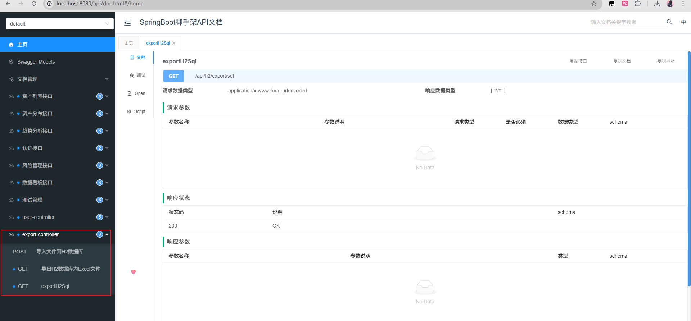

# 恒天金融资产数据分析及展示系统 - 后端服务

一个基于 Spring Boot 的金融资产数据分析及展示系统后端服务，提供完整的 RESTful API 接口，支持金融数据的存储、分析和可视化展示。

## 技术栈

- **框架**: Spring Boot 2.7.18
- **语言**: Java 11
- **ORM**: MyBatis-Plus 3.5.5
- **数据库**: H2 Database (内存数据库)
- **API 文档**: Knife4j 4.4.0 (基于 SpringDoc OpenAPI 3)
- **工具库**: Hutool 5.8.24 (Excel 导入导出)
- **构建工具**: Maven
- **日志**: SLF4J + Logback

## 项目结构

```
src/main/java/com/example/scaffold/
├── aspect/              # AOP 切面
│   └── LogAspect.java   # 日志切面
├── common/              # 通用类
│   ├── Result.java      # 统一响应结果封装
│   ├── ResultCode.java  # 响应码枚举
│   ├── PageResult.java  # 分页结果封装
│   └── HutoolH2ExportUtil.java  # H2数据库导入导出工具
├── config/              # 配置类
│   ├── CorsConfig.java  # 跨域配置
│   ├── SwaggerConfig.java  # Swagger/OpenAPI 配置
│   ├── Knife4jConfig.java  # Knife4j 配置
│   └── ImportXlsxProperties.java  # Excel导入配置
├── controller/          # 控制器层
│   ├── AuthController.java  # 认证接口
│   ├── DashboardController.java  # 数据看板接口
│   ├── AssetController.java  # 资产管理接口
│   ├── RiskController.java  # 风险管理接口
│   ├── TrendController.java  # 趋势分析接口
│   ├── DistributionController.java  # 资产分布接口
│   ├── ExportController.java  # 数据导入导出接口
│   ├── UserController.java  # 用户管理接口
│   └── TestController.java  # 测试接口
├── service/             # 服务层
│   ├── impl/           # 服务实现类
│   ├── AuthService.java
│   ├── DashboardService.java
│   ├── AssetService.java
│   ├── RiskService.java
│   ├── TrendService.java
│   ├── DistributionService.java
│   └── UserService.java
├── mapper/              # 数据访问层
│   ├── AssetMapper.java
│   ├── UserMapper.java
│   ├── RiskEventMapper.java
│   ├── PortfolioTrendMapper.java
│   └── ...
├── model/               # 实体类
│   ├── dto/           # 数据传输对象
│   ├── Asset.java
│   ├── User.java
│   ├── RiskEvent.java
│   └── ...
├── exception/          # 异常处理
│   ├── BusinessException.java
│   └── GlobalExceptionHandler.java
└── StarterApplication.java  # 启动类

src/main/resources/
├── application.yml     # 应用配置文件
├── schema.sql          # 数据库表结构
├── data.sql            # 初始化数据
└── api.md              # API 接口文档
```

## 快速开始

### 环境要求

- JDK 11 或更高版本
- Maven 3.6 或更高版本
- Docker 和 Docker Compose（可选，用于容器化部署）

### 安装依赖

```bash
mvn clean install
```

### 启动开发服务器

```bash
mvn spring-boot:run
```

或者直接运行主类：

```bash
java -jar target/financial-backend.jar
```

### 构建生产版本

```bash
mvn clean package
```

生成的可执行 JAR 文件位于 `target/financial-backend.jar`

## 部署方式

### 方式一：Docker 部署（推荐）

Docker 部署是最简单和一致的部署方式，适合生产环境。

#### 前置条件

1. 确保已安装 Docker 和 Docker Compose
2. 确保已构建 JAR 文件（`mvn clean package`）

#### 部署步骤

1. **构建 JAR 文件**

```bash
mvn clean package
```

2. **复制 JAR 文件到 Docker 目录**

```bash
# Windows
copy target\financial-backend.jar docker\jar\financial-backend.jar

# Linux/Mac
cp target/financial-backend.jar docker/jar/financial-backend.jar
```

3. **启动 Docker 容器**

```bash
cd docker
docker-compose up -d
```

4. **查看日志**

```bash
# 查看应用日志
docker logs -f financial-app

# 查看 Nginx 日志
docker logs -f financial-nginx
```

5. **停止服务**

```bash
docker-compose down
```

#### Docker 配置说明

- **应用服务** (`financial-app`): Spring Boot 应用，端口 8080
- **Nginx 服务** (`financial-nginx`): 反向代理，端口 80
- **JVM 内存配置**: 默认 `-Xms512m -Xmx2048m`，可在 `docker-compose.yml` 中修改

#### 自定义 JVM 参数

编辑 `docker/docker-compose.yml` 文件中的 `JAVA_OPTS` 环境变量：

```yaml
environment:
  - JAVA_OPTS=-Xms512m -Xmx2048m -XX:MetaspaceSize=256m -XX:MaxMetaspaceSize=512m
```

#### 访问应用

- **应用地址**: http://localhost:8080
- **API 文档**: http://localhost:8080/api/doc.html
- **H2 控制台**: http://localhost:8080/api/h2-console

### 方式二：普通 JAR 启动

适合本地开发或服务器直接部署。

#### 前置条件

1. 确保已安装 JDK 11 或更高版本
2. 确保已构建 JAR 文件（`mvn clean package`）

#### 启动步骤

1. **构建 JAR 文件**

```bash
mvn clean package
```

2. **启动应用（Windows）**

```bash
# 使用默认内存配置
java -jar target\financial-backend.jar

# 或指定 JVM 内存参数
java -Xms512m -Xmx2048m -XX:MetaspaceSize=256m -XX:MaxMetaspaceSize=512m -jar target\financial-backend.jar
```

3. **启动应用（Linux/Mac）**

```bash
# 使用默认内存配置
java -jar target/financial-backend.jar

# 或指定 JVM 内存参数
java -Xms512m -Xmx2048m -XX:MetaspaceSize=256m -XX:MaxMetaspaceSize=512m -jar target/financial-backend.jar
```

4. **后台运行（Linux/Mac）**

```bash
# 使用 nohup 后台运行
nohup java -Xms512m -Xmx2048m -jar target/financial-backend.jar > app.log 2>&1 &

# 查看进程
ps aux | grep financial-backend

# 停止应用（使用进程ID）
kill <PID>
```

#### 创建启动脚本（Linux/Mac）

创建 `start.sh` 文件：

```bash
#!/bin/bash

APP_HOME="$(cd "$(dirname "$0")" && pwd)"
JAR="$APP_HOME/target/financial-backend.jar"

# JVM 内存参数，可根据服务器内存调整
JAVA_OPTS="-Xms512m -Xmx2048m -XX:MetaspaceSize=256m -XX:MaxMetaspaceSize=512m"

echo "Starting financial-backend with: $JAVA_OPTS"
nohup java $JAVA_OPTS -jar "$JAR" > "$APP_HOME/app.log" 2>&1 &
echo $! > "$APP_HOME/app.pid"
echo "Started, PID: $(cat "$APP_HOME/app.pid")"
```

赋予执行权限并运行：

```bash
chmod +x start.sh
./start.sh
```

#### 创建启动脚本（Windows）

创建 `start.bat` 文件：

```batch
@echo off
set APP_HOME=%~dp0
set JAR=%APP_HOME%target\financial-backend.jar
set JAVA_OPTS=-Xms512m -Xmx2048m -XX:MetaspaceSize=256m -XX:MaxMetaspaceSize=512m

echo Starting financial-backend with: %JAVA_OPTS%
start "Financial Backend" java %JAVA_OPTS% -jar "%JAR%"
```

双击运行 `start.bat` 或在命令行执行：

```cmd
start.bat
```

#### 内存配置建议

根据服务器内存大小调整 JVM 参数：

- **内存 < 2GB**: `-Xms256m -Xmx1024m`
- **内存 2-4GB**: `-Xms512m -Xmx2048m`（默认）
- **内存 > 4GB**: `-Xms1024m -Xmx4096m`

#### 访问应用

- **应用地址**: http://localhost:8080
- **API 文档**: http://localhost:8080/api/doc.html
- **H2 控制台**: http://localhost:8080/api/h2-console

## 主要功能模块

### 1. 认证模块 (`/api/auth`)
- 用户登录
- 获取用户信息
- Token 认证

### 2. 数据看板模块 (`/api/dashboard`)
- 获取仪表板核心指标
- 获取资产分布数据
- 获取业绩趋势数据

### 3. 资产管理模块 (`/api/assets`)
- 资产列表查询（支持分页、搜索、筛选、排序）
- 资产详情查询
- 行业筛选选项
- 资产新增

### 4. 风险管理模块 (`/api/risk`)
- 获取风险指标
- 获取回撤数据
- 获取风险事件

### 5. 趋势分析模块 (`/api/trend`)
- 获取投资组合趋势数据
- 获取月度收益数据
- 获取趋势分析统计指标

### 6. 资产分布模块 (`/api/distribution`)
- 获取资产配置数据
- 获取历史配置变化数据
- 获取资产分布统计指标

### 7. 数据导入导出模块 (`/api/h2`)
- 导出 H2 数据库为 Excel 文件
- 导出 H2 数据库为 SQL 文件
- 导入 SQL/XLSX 文件到 H2 数据库

## API 文档

### 访问地址

- **Knife4j 文档**: http://localhost:8080/api/doc.html
- **Swagger UI**: http://localhost:8080/api/swagger-ui/index.html
- **OpenAPI JSON**: http://localhost:8080/api/v3/api-docs

### 接口说明

详细的 API 接口文档请参考 `src/main/resources/api.md` 文件。

## 数据库

### H2 控制台

- **访问地址**: http://localhost:8080/api/h2-console
- **JDBC URL**: `jdbc:h2:mem:testdb`
- **用户名**: `sa`
- **密码**: (空)

### 数据库初始化

项目启动时会自动执行以下操作：

1. **表结构初始化**: 自动执行 `schema.sql` 创建表结构
2. **基础数据初始化**: 自动执行 `data.sql` 加载基础数据（用户数据、资产数据等）
3. **资产趋势数据自动生成**: 启动完成后，`AssetTrendDataGenerator` 会自动为所有 `asset` 记录生成两年内的 `asset_trend` 数据

> **注意**: `asset_trend` 数据不再存储在 `data.sql` 中，而是在应用启动后自动生成，以避免文件过大导致 OOM 错误。

## 配置说明

### 应用配置 (`application.yml`)

```yaml
server:
  port: 8080
  servlet:
    context-path: /api

spring:
  datasource:
    url: jdbc:h2:mem:testdb;MODE=MYSQL;DB_CLOSE_DELAY=-1;DB_CLOSE_ON_EXIT=FALSE
    driver-class-name: org.h2.Driver
    username: sa
    password:
```

### 数据导入配置

支持在启动时自动导入 Excel 或 SQL 文件：

```yaml
import-xlsx:
  path: classpath:init.xlsx  # 或 file:/path/to/file.sql
```

## 演示账户

系统提供以下演示账户：

1. **管理员账户**
   - 用户名: `admin`
   - 密码: `admin123`

2. **普通用户账户**
   - 用户名: `user1`
   - 密码: `user123`

## 统一响应格式

所有 API 接口统一使用 `Result<T>` 封装响应：

```json
{
  "success": true,
  "code": 200,
  "message": "操作成功",
  "data": {},
  "timestamp": 1640995200000
}
```

## 异常处理

- 全局异常处理器: `GlobalExceptionHandler`
- 业务异常: `BusinessException`
- 统一错误响应格式

## 开发规范

### 代码风格

- 使用 Lombok 简化代码
- 遵循 RESTful API 设计规范
- 统一使用 `Result` 封装响应
- Controller 层添加 Swagger 注解

### 数据库规范

- 使用 MyBatis-Plus 进行数据库操作
- 实体类使用 `@TableName` 指定表名
- 主键使用 `@TableId(type = IdType.AUTO)`

## 健康检查

- **健康检查接口**: http://localhost:8080/api/test/health

## 补充
访问 http://localhost:8080/api/doc.html#/home 可以进行数据的导入/导出
